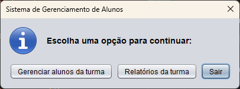
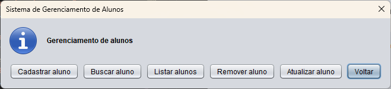
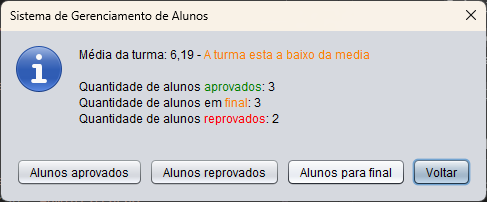
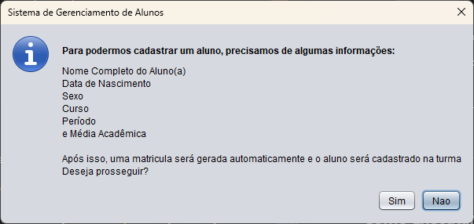

# Sistema de Gerenciamento de Alunos


## Sobre o Projeto

O projeto foi um trabalho para a disciplina de Programação Orientada a Objetos, ministrada pelo Prof. Dr. Mayrton Dias de Queiroz.

 Ele simula um sistema básico para gerenciar uma turma de alunos, permitindo operações de cadastro, consulta, atualização e exclusão, além de gerar relatórios simples sobre o desempenho da turma.

Toda a interação com o usuário é realizada através de caixas de diálogo (`JOptionPane`) da biblioteca Swing.

## Funcionalidades Principais

O sistema permite ao usuário realizar as seguintes ações através de um menu interativo:

* **Gerenciar Alunos:**
    * **Cadastrar:** Adicionar um novo aluno à turma, inserindo dados como nome, data de nascimento, sexo, curso, período e média. Uma matrícula é gerada automaticamente.

    * **Buscar:** Procurar por um aluno específico usando sua matrícula.

    * **Listar:** Exibir a lista completa de todos os alunos cadastrados na turma.

    * **Remover:** Excluir o cadastro de um aluno da turma.

    * **Atualizar:** Modificar dados de um aluno já existente.

* **Relatórios da Turma:**
    * Exibir a **média geral** da turma.

    * Contabilizar a **quantidade** de alunos Aprovados, Reprovados ou em Final.

    * Listar alunos filtrados por **situação** (Aprovado, Reprovado, Final).


## Estrutura do Projeto

O código é dividido em classes com responsabilidades bem definidas:

* `App.java`: Classe principal (main) que inicializa o sistema, controla o menu principal e gerencia a interação com o usuário.

* `GerenciarAlunos.java`: Classe que armazena a turma (um array de `Aluno`) e contém os métodos para manipulação (CRUD) e geração de relatórios.

* `Aluno.java`: Classe de modelo (entidade) que representa um aluno, seus dados pessoais e acadêmicos. Também calcula a situação (Aprovado, etc.) com base na média.

* `Data.java`: Classe auxiliar para representar e formatar datas. Contém o método estático para calcular a idade.

* `DataBox.java`: Classe utilitária que cria uma caixa de diálogo `JOptionPane` customizada para seleção de dia, mês e ano.

* `Sexo.java`: Enum que define os sexos possíveis (M/F).

## Screenshots
Algumas prints tiradas durante a execução do código:







## Como Executar

1.  Certifique-se de ter o Java (JDK) instalado.

2.  Compile todas as classes `.java` dentro da pasta `src/app/`.
    ```bash
    javac src/app/*.java
    ```
3.  Execute a classe principal `App`.
    ```bash
    java -cp src app.App
    ```

## Autor

Feito por **[Artur Saraiva Rabelo](https://github.com/artur-sres)**.
